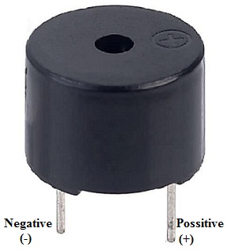

# Smart Shoes for Blind People (IoT-Based Project)

## Introduction

The **Smart Shoes for Blind People** project is an IoT-based innovation aimed at enhancing mobility and safety for visually impaired individuals. These smart shoes are equipped with ultrasonic sensors and buzzers to detect obstacles and alert the user, reducing the risk of collisions in their path.

---

## Features

- **Obstacle Detection**: Utilizes ultrasonic sensors to identify nearby objects.
- **Auditory Alerts**: Emits a buzzer sound to notify the user of obstacles.
- **Compact and Wearable**: Designed to integrate seamlessly into footwear.
- **Arduino-Based**: Powered by Arduino with a simple and efficient codebase.

---

## Hardware Requirements

- Arduino Uno or similar microcontroller
- Ultrasonic Sensor (e.g., HC-SR04)
- Buzzer
- Connecting Wires
- Power Supply
- Shoes (for integration)

---

## Software Requirements

- Arduino IDE (for programming the microcontroller)
- Libraries:
  - Standard Arduino libraries (pre-installed with Arduino IDE)

---

## Installation and Setup

1. **Clone the Repository**:
   ```bash
   git clone https://github.com/your-username/SmartShoesForBlindPeople.git
   ```

2. **Open the Code**:
   - Navigate to the `Ultrasonic_with_Buzzer_CODE.ino` file.
   - Open it in the Arduino IDE.

3. **Connect the Components**:
   - Follow the `Buzzer-Pin-Configuration.jpg` for wiring.

4. **Upload the Code**:
   - Connect the Arduino to your computer using a USB cable.
   - Select the correct port in the Arduino IDE.
   - Click on the **Upload** button.

5. **Test the System**:
   - Place obstacles at varying distances to test the detection and buzzer functionality.

---

## Project Structure

```plaintext
SmartShoesForBlindPeople/
├── Ultrasonic_with_Buzzer_CODE.ino  # Arduino source code
├── Buzzer-Pin-Configuration.jpg     # Wiring diagram
├── doc_project_REPORT.pdf           # Detailed project documentation
├── Media/                           # Images and video demonstrations
└── README.md                        # Project description (this file)
```

---

## Demonstration



### Video Preview:
[Watch the demonstration video](WhatsApp%20Video%202023-03-10%20at%207.46.51%20PM.mp4)

---

## License

This project is licensed under the MIT License. See the `LICENSE` file for details.

---

## Acknowledgments

- Developed by: [Your Name]
- Special thanks to the open-source community for libraries and resources.

---

## Contact

For inquiries or collaboration, reach out to [your-email@example.com].
